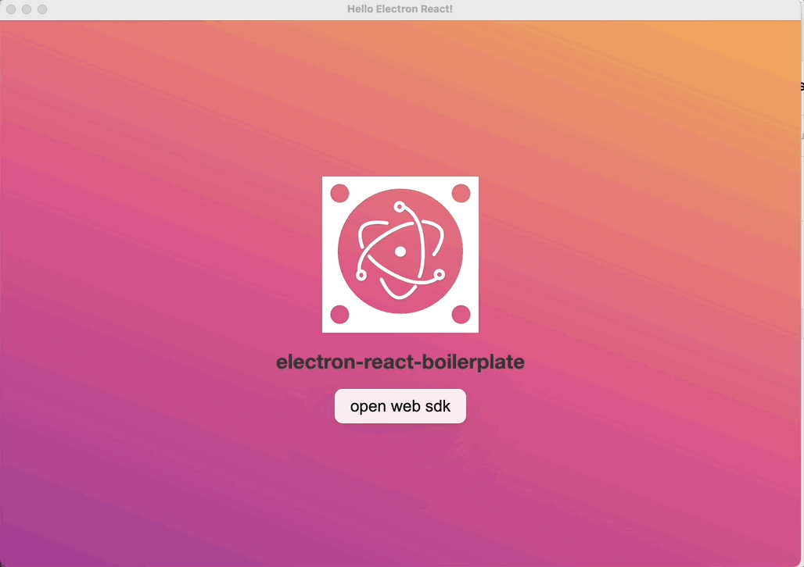
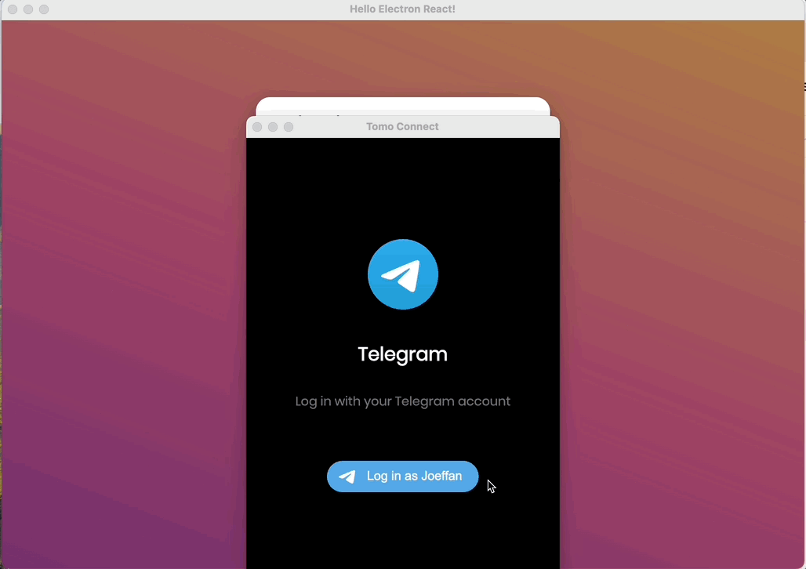
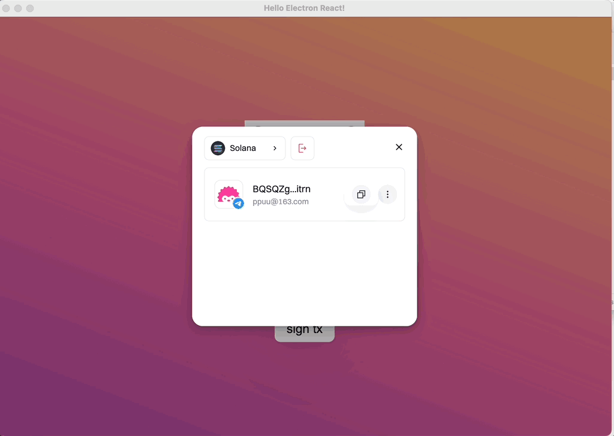

# Web SDK Electron Boilerplate

This is a boilerplate for Tomo Web SDK, extended from [Electron-React-Boilerplate](https://github.com/electron-react-boilerplate/electron-react-boilerplate.git)


<br>

<p>
  Electron React Boilerplate uses <a href="https://electron.atom.io/">Electron</a>, <a href="https://facebook.github.io/react/">React</a>, <a href="https://github.com/reactjs/react-router">React Router</a>, <a href="https://webpack.js.org/">Webpack</a> and <a href="https://www.npmjs.com/package/react-refresh">React Fast Refresh</a>.
</p>

<br>


## Install

Clone the this repo and install dependencies

## Starting Development

Start the app in the `dev` environment:

```bash
npm start
```

## Packaging for Production

To package apps for the local platform:

```bash
npm run package
```

## Enable Window Open
```typescript
/** src/main/main.ts */

// ❌ this will break web-sdk's ability to open popup window
// mainWindow.webContents.setWindowOpenHandler((edata) => {
//   shell.openExternal(edata.url);
//   return { action: 'deny' };
// });

// ✅
mainWindow.webContents.setWindowOpenHandler((data) => {
  // Or allow opening in a new window with custom options
  return { 
    action: 'allow',
  }
})
```

## Screenshots


